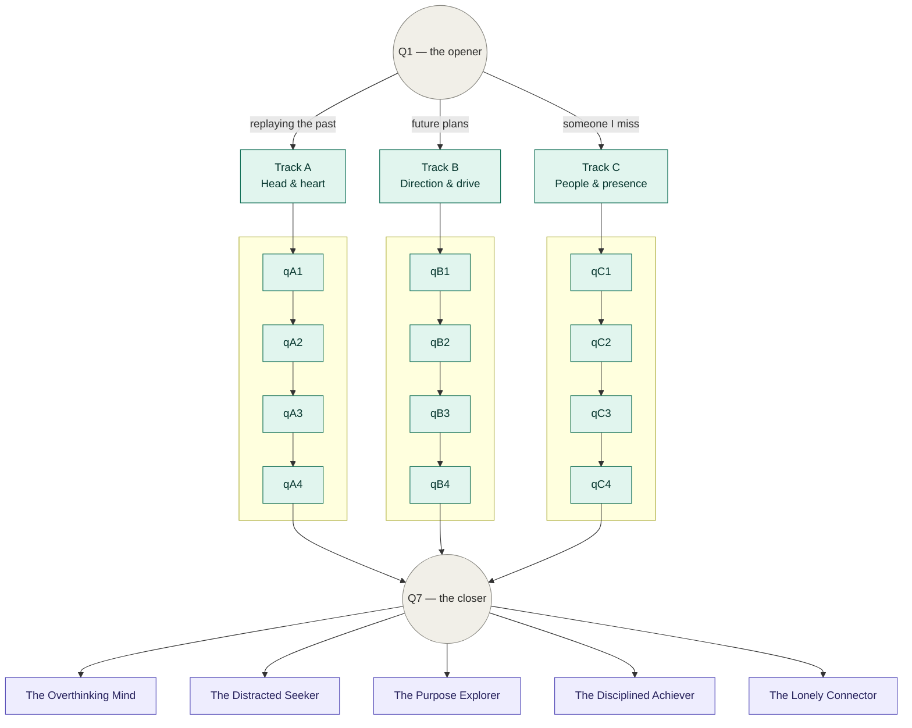

# AncientAI — Life Audit

*Question bank & adaptive routing logic*

Seven questions per onboarding session, pulled from a pool of 22. Only Q1 and Q7 are the same for everyone — everything in between depends on how Q1 was answered.

## Routing graph

*(Q2, the unscored rapport question, always runs right after Q1 for everyone — omitted above to keep the graph readable. It sits between Q1 and the track's first question in every session.)*

## Session flow

| Step | Question | Type | What it does |
|---|---|---|---|
| 1 | `q_root` | Universal | The opener — routes the session into one of 3 tracks |
| 2 | `q_rapport_*` | Universal | Rapport question (movie / song / childhood thing) — not scored |
| 3–6 | track question 1–4 | Track-specific | 4 fixed deep-dive questions for whichever track Q1 selected |
| 7 | `q_closer_1` | Universal | The closer — also the tiebreaker |

**Scoring:** every answer adds points to 1–2 of six dimensions. After Q7, the highest-scoring dimension determines the archetype. Identity & self-worth never wins outright — it folds into whichever other dimension it showed up alongside most in that session. If the top two dimensions are within 2 points, the tiebreak prefers the Q1 track, then whatever Q7 pointed to.

## Dimensions

| Dimension | What it captures |
|---|---|
| Mind & attention | Rumination, focus, how loud the internal narrator is |
| Identity & self-worth | A modifier, not its own archetype — folds into whichever dimension it co-occurs with |
| Habits & discipline | Systems, follow-through, structure |
| Relationships | Closeness, who's actually in someone's corner |
| Purpose & direction | Clarity on the "why", long-range intent |
| Spiritual curiosity | Searching, sampling practices/ideas, not yet committed to one |

## The five results

### The Overthinking Mind
*Primary dimension: Mind & attention*

You think in loops — replaying, rehearsing, running scenarios that already happened or haven't happened yet. It's not a flaw, it's a mind that cares deeply and hasn't been given a place to rest. The work here isn't to think less, it's to think on purpose.

- **Free lesson:** Stilling the loop
- **7-day challenge:** Five minutes of guided stillness, once a day, no phone in the room.

### The Distracted Seeker
*Primary dimension: Spiritual curiosity*

You're genuinely curious — about meaning, growth, the bigger questions — but you've collected more starting points than finish lines. That's not a lack of discipline, it's a lack of a compass. Once you find the one thread worth pulling, you'll surprise yourself with how far you follow it.

- **Free lesson:** Picking one thread
- **7-day challenge:** One practice only, no swapping, for seven days straight.

### The Purpose Explorer
*Primary dimension: Purpose & direction*

You know there's a "why" out there, and you're actively hunting for it. That already puts you ahead of most people, who never ask. The next step isn't finding more answers, it's testing the ones you already suspect are true.

- **Free lesson:** Naming the why
- **7-day challenge:** Daily journal prompts that narrow a vague purpose into a specific one.

### The Disciplined Achiever
*Primary dimension: Habits & discipline*

You show up. Systems, routines, follow-through — you've already built the machinery most people are still trying to figure out. The real question isn't whether you can do the work, it's whether the work is pointed somewhere that actually matters to you.

- **Free lesson:** Discipline with direction
- **7-day challenge:** Attach one existing habit to a purpose statement and track how it feels.

### The Lonely Connector
*Primary dimension: Relationships*

You care about people more than you let on, and you notice exactly how close, or not, you feel to the ones around you. Sometimes it's easier to give presence than to ask for it back. This one's about closing that gap, safely, on your terms.

- **Free lesson:** Letting someone in
- **7-day challenge:** One small, low-stakes act of reaching out, every day for a week.

## Full question bank

### Q1 — the opener (universal)

**`q_root`** — When your mind gets five free minutes, no phone, nothing to do, where does it usually go?

- Replaying something that already happened → Track A *(mind_attention +2)*
- Where I want to be in a few years → Track B *(purpose_direction +2)*
- Someone I haven't checked in on in a while → Track C *(relationships +2)*

### Q2 — rapport (universal, not scored)

- `q_rapport_1`: Okay, switching gears. What's a movie you could rewatch on literally any day, no questions asked? (We'll tell you ours too.)
- `q_rapport_2`: Random one: what's a song that instantly fixes your mood?
- `q_rapport_3`: What's something you were low-key obsessed with as a kid that you still think about?

### Track A — Head & Heart
*Dimensions: Mind & attention, Spiritual curiosity*

**`qA1`** — Do you replay conversations in your head after they're over?
- All the time, I could write the transcript *(mind_attention +3)*
- Sometimes, if something felt off *(mind_attention +1, identity_selfworth +1)*
- Rarely, once it's done it's done *(habits_discipline +1)*

**`qA2`** — When something's bothering you, what usually happens?
- I think about it until I've thought it to death *(mind_attention +2)*
- I go looking for an answer — books, podcasts, random advice *(spiritual_curiosity +2)*
- I talk to someone about it *(relationships +2)*

**`qA3`** — Be honest, how many self-improvement things have you started and not finished?
- Too many to count, but I mean it every time *(spiritual_curiosity +3)*
- A few, but I'm still doing one of them *(habits_discipline +1, spiritual_curiosity +1)*
- Not really my thing *(mind_attention +1)*

**`qA4`** — What does "peace of mind" look like for you right now?
- Just quiet, no noise in my head *(mind_attention +2)*
- Finally understanding what I actually believe *(spiritual_curiosity +3)*
- Not caring so much what people think *(identity_selfworth +2)*

**`qA5` (alt)** — Do you ever feel like you're overthinking something that shouldn't matter this much?
- Constantly *(mind_attention +3)*
- Only with big decisions *(mind_attention +1, identity_selfworth +1)*
- Not really, I move on fast *(habits_discipline +1)*

### Track B — Direction & Drive
*Dimensions: Purpose & direction, Habits & discipline*

**`qB1`** — Do you have a five-year plan, or are you more "let's see what happens"?
- Yeah, pretty mapped out *(purpose_direction +3)*
- Rough direction, figuring out details as I go *(purpose_direction +1, habits_discipline +1)*
- Not really, I like keeping options open *(spiritual_curiosity +1)*

**`qB2`** — When you set a goal, what usually happens?
- I build a system and stick to it *(habits_discipline +3)*
- I get excited, then life happens *(purpose_direction +1)*
- I finish it, then immediately want the next one *(purpose_direction +2, habits_discipline +1)*

**`qB3`** — Which is more true: "I know what I want but not how to get there", or "I know how to work hard but not what I'm working toward"?
- Know the what, not the how *(purpose_direction +3)*
- Know the how, not the what *(habits_discipline +3)*
- Honestly, neither is clear right now *(spiritual_curiosity +2)*

**`qB4`** — Do you track your habits, sleep, workouts, routines, or just go with the flow?
- Tracked, structured, non-negotiable *(habits_discipline +3)*
- Loosely, when I remember *(habits_discipline +1)*
- Not at all, and it doesn't bother me *(purpose_direction +1)*

**`qB5` (alt)** — If you had a completely free year with money handled, what would you actually do with it?
- Build something — a project, a business, a skill *(purpose_direction +3)*
- Get my systems together — health, routine, discipline *(habits_discipline +2)*
- Travel, explore, figure out what I even want *(spiritual_curiosity +2)*

### Track C — People & Presence
*Dimensions: Relationships, Identity & self-worth*

**`qC1`** — How many people could you call right now, at a bad moment, and know they'd pick up?
- A handful, easily *(relationships +1)*
- Maybe one or two *(relationships +2, identity_selfworth +1)*
- Honestly, I'm not sure *(relationships +3, identity_selfworth +2)*

**`qC2`** — Do you find it easy to ask for help when you need it?
- Yeah, I ask without overthinking it *(identity_selfworth +1)*
- I can, but I hesitate first *(identity_selfworth +2)*
- Not really, I'd rather figure it out alone *(identity_selfworth +3, relationships +1)*

**`qC3`** — When was the last time you felt truly understood by someone?
- Recently *(relationships +1)*
- It's been a while *(relationships +2)*
- Honestly, can't remember *(relationships +3, identity_selfworth +1)*

**`qC4`** — Do you feel closer to people, or more like you're performing around them?
- Closer, mostly *(relationships +1)*
- Depends who it is *(relationships +1, identity_selfworth +1)*
- Performing, more often than I'd like *(identity_selfworth +3)*

**`qC5` (alt)** — If you disappeared for a week with no explanation, who'd actually notice fast?
- A few people, for sure *(relationships +1)*
- One or two *(relationships +2)*
- I genuinely don't know *(relationships +3)*

### Q7 — the closer (universal)

**`q_closer_1` (default)** — Last one. If we could hand you exactly one thing right now, clarity, calm, connection, or momentum, which would you take?
- Clarity *(purpose_direction +2)*
- Calm *(mind_attention +2)*
- Connection *(relationships +2)*
- Momentum *(habits_discipline +2)*

**`q_closer_2` (alt)** — One more: on a scale from "I've got it together" to "still figuring it out", where are you today?
- Mostly together / Somewhere in between / Honestly, still figuring it out *(not scored)*

**`q_closer_3` (alt)** — Last thing: if this quiz told you something you already kind of knew deep down, what do you think it'd be? *(open text, optional, not scored)*
