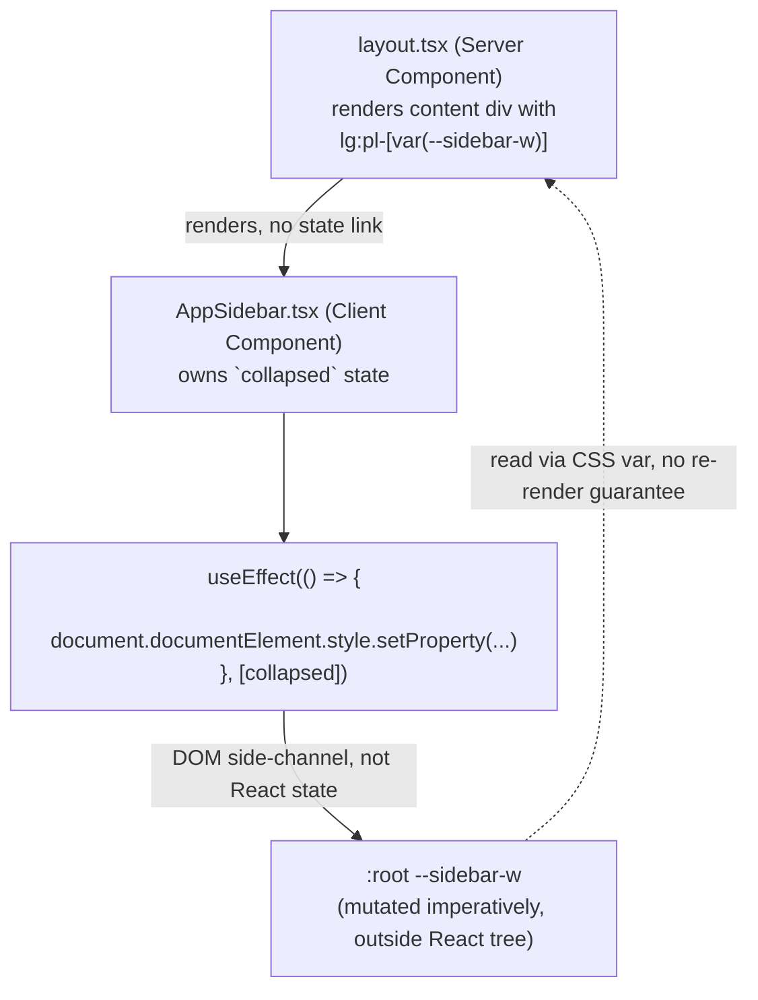
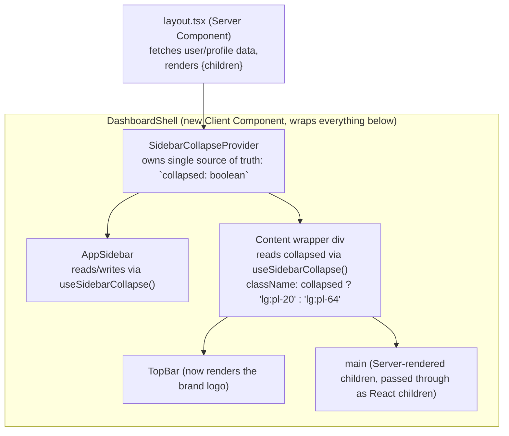
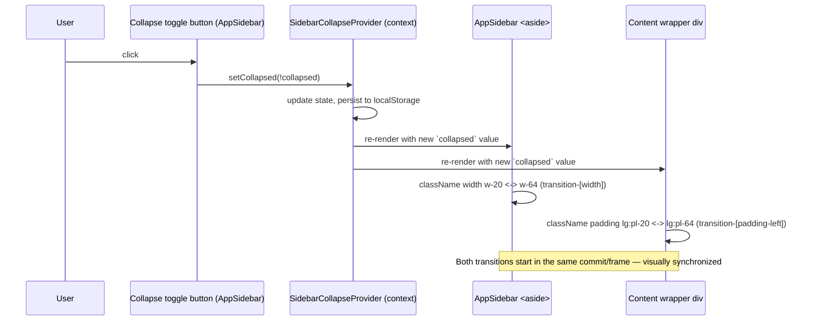
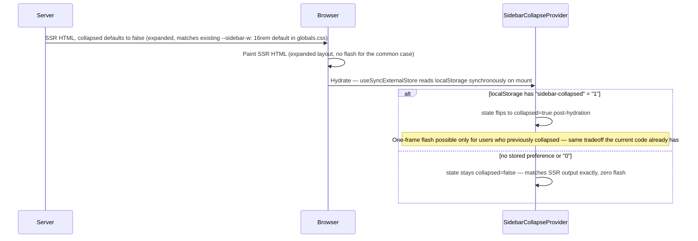

# Design Document: Dashboard Sidebar Collapse Fix

## Overview

The desktop dashboard sidebar (`AppSidebar.tsx`) toggles between a collapsed (`w-20`, icon-only) and expanded (`w-64`) state, but the main content wrapper in the Server Component `app/dashboard/layout.tsx` does not reliably resize in sync, because the two are coupled only through an imperative `document.documentElement.style.setProperty("--sidebar-w", ...)` side-channel rather than shared React state. This design replaces that side-channel with a single client-side state owner (a context provider) that both the sidebar and the content offset read from directly, and relocates the brand logo out of the collapsible sidebar into the always-visible `TopBar`.

This design uses TypeScript/React (Next.js App Router), matching the existing codebase — no pseudocode is used for code samples.

## Architecture

### Before (current, buggy)



**Problem:** `layout.tsx` and `AppSidebar.tsx` share no React state. The only link is a mutable global CSS variable written imperatively from an effect. There is nothing that forces the content wrapper to re-render or reliably reflect the new value in lockstep with the sidebar's own width transition, and the mechanism lives entirely outside the component tree's data flow — it is invisible to React, to prop drilling, and to context.

### After (fixed)



**Fix:** `collapsed` becomes a single piece of React state owned by `SidebarCollapseProvider`, a Client Component. Both `AppSidebar` (which toggles it) and the content wrapper (which reads it to compute padding) are descendants of the same provider and consume the same context value. A change to `collapsed` triggers a synchronous re-render of both consumers in the same commit — there is no cross-tree side-channel. `layout.tsx` remains a Server Component: it still does the data fetching (`profile`, `points`, etc.) and passes `children` (the page content, itself possibly further Server Components) straight through as the `children` prop of the new Client Component wrapper, which is the standard, supported pattern for mixing Server and Client Components in the App Router — Server Component output can be passed as `children` to a Client Component without forcing the children to become client-rendered themselves.

### Component tree

```
app/dashboard/layout.tsx  (Server Component — unchanged responsibilities: auth, profile fetch)
└── DashboardShell  (NEW — Client Component)
    └── SidebarCollapseProvider  (NEW — Client Component, holds `collapsed` state + localStorage sync)
        ├── AppSidebar  (Client Component — MODIFIED: no longer owns `collapsed` state locally; consumes context; brand/logo removed from desktop <aside>)
        └── div.content-wrapper  (MODIFIED — className driven by context, not CSS var)
            ├── TopBar  (MODIFIED — now renders the brand logo)
            └── main
                └── {children}  (Server-rendered page content, passed through unchanged)
```

## Sequence Diagrams

### Toggle collapse (fixed flow)



### Initial load / hydration (no-flash strategy)



## Components and Interfaces

### 1. `SidebarCollapseProvider` (new file: `components/dashboard/SidebarCollapseContext.tsx`)

**Purpose**: Single source of truth for the sidebar's collapsed/expanded state. Replaces the `useState` + imperative CSS-var effect that currently lives inside `AppSidebar`.

**Interface**:
```typescript
type SidebarCollapseContextValue = {
  collapsed: boolean;
  setCollapsed: (value: boolean | ((prev: boolean) => boolean)) => void;
};

export function SidebarCollapseProvider(props: { children: React.ReactNode }): JSX.Element;
export function useSidebarCollapse(): SidebarCollapseContextValue;
```

**Responsibilities**:
- Own the `collapsed` boolean as React state.
- Read the initial value from `localStorage` (key: `sidebar-collapsed`) without causing a hydration mismatch (see Low-Level Design below).
- Persist every change back to `localStorage`.
- Provide `collapsed` and `setCollapsed` to descendants via `React.Context`.
- No longer touches `document.documentElement.style` at all — the CSS var side-channel is removed entirely.

### 2. `DashboardShell` (new file: `components/dashboard/DashboardShell.tsx`)

**Purpose**: The Client Component boundary that lets a Server Component (`layout.tsx`) delegate the collapse-aware layout to the client, while still passing server-rendered `children` straight through.

**Interface**:
```typescript
type DashboardShellProps = {
  displayName: string;
  avatarUrl?: string | null;
  level: number;
  title: string;
  isAdmin?: boolean;
  points: number;
  children: React.ReactNode;
};

export function DashboardShell(props: DashboardShellProps): JSX.Element;
```

**Responsibilities**:
- Wrap `SidebarCollapseProvider` around `AppSidebar` and the content wrapper.
- Render the content wrapper `div` whose `className` is computed from `useSidebarCollapse()` (`lg:pl-20` vs `lg:pl-64`), replacing `lg:pl-[var(--sidebar-w)]`.
- Render `TopBar` (now carrying the logo) and `<main>{children}</main>` inside the content wrapper.

### 3. `AppSidebar` (modified: `components/dashboard/AppSidebar.tsx`)

**Changes**:
- Remove local `collapsed` state and the `useEffect` that set `--sidebar-w` and read `localStorage` directly — both move into `SidebarCollapseProvider`. `AppSidebar` instead calls `const { collapsed, setCollapsed } = useSidebarCollapse();`.
- Remove the logo (`` inside `Link href="/"`) from `renderBrand()`'s desktop-facing usage. The desktop `<aside>` no longer calls `renderBrand()` at all in its current form.
- Introduce a new, smaller render function `renderCollapseToggle()` that renders **only** the collapse/expand button (previously bundled into `renderBrand`), placed as its own row at the top of the desktop `<aside>`, above `renderNav()`. In collapsed mode it centers; in expanded mode it right-aligns, matching the current toggle's existing button styling (`PanelLeftClose`/`PanelLeftOpen` icons, `aria-pressed`, `title`).
- The mobile drawer's `renderBrand(false)` call is unaffected — mobile drawer keeps showing the logo (see Mobile Decision below), since it is a fully-expanded, non-collapsible surface.
- `renderNav`, `renderFooter`, active-pill (`layoutId="sidebar-pill"`), icon-only `title`/`aria-label` treatment, sign-out button, and footer avatar/level display are unchanged.

### 4. `TopBar` (modified: `components/dashboard/TopBar.tsx`)

**Changes**:
- Add the brand logo (`<Link href="/"></Link>`) as the leading element of the `<header>`, to the left of the search button, consistent with the frosted topbar in `06_UI_DESIGN_SYSTEM.md` §4 and §7 layout reference.
- `TopBar` remains `hidden ... lg:flex` (desktop-only) — see Mobile Decision below for why this is not a regression.

### 5. `app/dashboard/layout.tsx` (modified)

**Changes**:
- Remove the manual `<AppSidebar .../>` + content-wrapper `<div className="... lg:pl-[var(--sidebar-w)] ...">` + `<TopBar .../>` + `<main>` markup.
- Replace with a single `<DashboardShell {...props}>{children}</DashboardShell>`, keeping all existing Server Component responsibilities (auth check, profile fetch, `onboarded` redirect, ambient glow div) unchanged.

### 6. `app/globals.css`

**Changes**:
- The `--sidebar-w: 16rem` custom property is no longer read by any component (the content wrapper now uses Tailwind width utility classes driven by context state). It can be safely removed. It is kept documented here as removed, not silently deleted without note, since another part of the codebase could theoretically reference it (verified: `grep` shows only the `:root` definition and the one consumer being replaced).

## Mobile Decision (explicit, resolved)

**Decision:** Mobile keeps its own logo, unchanged, inside `AppSidebar`'s mobile top bar (`lg:hidden` block). `TopBar`'s newly-added logo does **not** need a mobile-visible variant.

**Rationale:**
- `TopBar` is already `hidden ... lg:flex` — desktop-only by design, per `06_UI_DESIGN_SYSTEM.md` (topbar is part of the desktop frosted-shell layout in §7).
- `AppSidebar`'s mobile top bar (the `fixed inset-x-0 top-0 ... lg:hidden` block) is a separate, independent surface that already renders the logo today and is not part of the collapse/expand bug — it has no collapsed state at all.
- Therefore removing the logo from the collapsible desktop `<aside>` and adding it to `TopBar` only affects desktop. Mobile visually stays exactly as it is today (logo top-left of the mobile bar, hamburger menu, vibe shortcut). No new mobile-specific logo variant is required.

## Data Models

```typescript
// components/dashboard/SidebarCollapseContext.tsx

/** Key used to persist the user's collapse preference across sessions. */
const SIDEBAR_COLLAPSE_KEY = "sidebar-collapsed";

/** Shape of the context value shared by AppSidebar and the content wrapper. */
interface SidebarCollapseContextValue {
  collapsed: boolean;
  setCollapsed: (value: boolean | ((prev: boolean) => boolean)) => void;
}
```

No server-side data model changes. `DashboardShellProps` (above) is the only new prop-flow shape, and it mirrors the props `AppSidebar`/`TopBar` already receive today — it is purely a pass-through aggregation, not new business data.

## Key Functions with Formal Specifications

### Function 1: `useSidebarCollapse()`

```typescript
function useSidebarCollapse(): SidebarCollapseContextValue
```

**Preconditions:**
- Must be called from a component rendered inside `<SidebarCollapseProvider>`.

**Postconditions:**
- Returns the current `collapsed` boolean and a stable `setCollapsed` function.
- Throws a descriptive error if called outside a `SidebarCollapseProvider` (fail fast, rather than silently returning `undefined` and producing a confusing downstream crash).
- The returned `collapsed` value is referentially consistent with the value most recently committed by `setCollapsed` — i.e., there is no intermediate render where `AppSidebar` and the content wrapper observe different values of `collapsed` for the same commit.

**Loop Invariants:** N/A (no loops).

### Function 2: `SidebarCollapseProvider(props)`

```typescript
function SidebarCollapseProvider(props: { children: React.ReactNode }): JSX.Element
```

**Preconditions:**
- Rendered once per dashboard shell instance (not remounted per-navigation, so state and localStorage listeners are not needlessly re-initialized).

**Postconditions:**
- On first client paint, `collapsed` exactly matches the value used during SSR (`false`), guaranteeing no hydration mismatch warning.
- After hydration completes, if `localStorage.getItem(SIDEBAR_COLLAPSE_KEY) === "1"`, `collapsed` updates to `true` in a subsequent commit.
- Every call to `setCollapsed` results in: (a) the context value updating, and (b) `localStorage.setItem(SIDEBAR_COLLAPSE_KEY, collapsed ? "1" : "0")` being called with the new value.
- Never calls `document.documentElement.style.setProperty` — the CSS variable side-channel is fully removed.

**Loop Invariants:** N/A.

### Function 3: `readStoredCollapsed()` (internal helper, used by `useSyncExternalStore`)

```typescript
function readStoredCollapsed(): boolean
```

**Preconditions:** None (safe to call in both server and client environments).

**Postconditions:**
- Returns `false` if called where `window`/`localStorage` is unavailable (SSR) — this is also the `getServerSnapshot` used by `useSyncExternalStore`, guaranteeing the SSR-rendered value and the first client snapshot never diverge.
- Returns `true` iff `localStorage.getItem(SIDEBAR_COLLAPSE_KEY) === "1"` when running in the browser.

**Loop Invariants:** N/A.

## Correctness Properties

*A property is a characteristic or behavior that should hold true across all valid executions of a system-essentially, a formal statement about what the system should do. Properties serve as the bridge between human-readable specifications and machine-verifiable correctness guarantees.*

### Property 1: Sidebar width and content padding are never mutually inconsistent

For any sequence of `collapse`/`expand` toggle operations applied to `SidebarCollapseProvider`, and at every render produced during that sequence, the sidebar's width class and the content wrapper's padding class SHALL never be observed in a mutually inconsistent pairing.

Formally, letting `collapsed` be the boolean state at a given render, `sidebarClass` be `AppSidebar`'s width class at that render, and `paddingClass` be the content wrapper's padding class at that render:

```
∀ render r in the sequence:
  (collapsed(r) = true  ⟺ sidebarClass(r) = "w-20")  ∧  (collapsed(r) = true  ⟺ paddingClass(r) = "lg:pl-20")
  (collapsed(r) = false ⟺ sidebarClass(r) = "w-64")  ∧  (collapsed(r) = false ⟺ paddingClass(r) = "lg:pl-64")
```

Equivalently, there is no valid render `r` such that `sidebarClass(r)` and `paddingClass(r)` reflect different values of `collapsed` (e.g., `sidebarClass(r) = "w-20"` while `paddingClass(r) = "lg:pl-64"` is impossible for all `r`).

This invariant is verified by the `fast-check` property-based test described under Testing Strategy → Property-Based Testing Approach; see that section for the test methodology, tooling, and iteration strategy rather than duplicating it here.

**Validates: Requirements 1.1, 1.2, 1.3, 1.4, 1.5, 2.1, 2.2, 2.3**

## Algorithmic Pseudocode

### `SidebarCollapseProvider` — avoiding hydration mismatch with `useSyncExternalStore`

```pascal
COMPONENT SidebarCollapseProvider(children)
BEGIN
  // subscribe/getSnapshot/getServerSnapshot triple avoids the classic
  // "read localStorage in useEffect" flash-then-fix pattern by giving
  // React an explicit, safe way to reconcile server vs client snapshots.
  storedCollapsed ← useSyncExternalStore(
    subscribe: (callback) => noop_unsubscribe_function,   // preference does not change from other tabs in this feature's scope
    getSnapshot: readStoredCollapsed,                      // client: reads localStorage
    getServerSnapshot: () => false                         // server: always expanded default
  )

  [collapsed, setCollapsedState] ← useState(storedCollapsed)

  // Re-sync local state if the externally-derived snapshot changes
  // (covers the post-hydration flip described in the sequence diagram).
  useEffect(() => {
    setCollapsedState(storedCollapsed)
  }, [storedCollapsed])

  FUNCTION setCollapsed(next)
    resolved ← IS_FUNCTION(next) ? next(collapsed) : next
    setCollapsedState(resolved)
    window.localStorage.setItem(SIDEBAR_COLLAPSE_KEY, resolved ? "1" : "0")
  END FUNCTION

  RETURN (
    <SidebarCollapseContext.Provider value={{ collapsed, setCollapsed }}>
      {children}
    </SidebarCollapseContext.Provider>
  )
END COMPONENT
```

**Preconditions:**
- `SIDEBAR_COLLAPSE_KEY` is a module-level constant, shared by no other component.

**Postconditions:**
- `collapsed` transitions at most twice on initial load: once at mount (matching SSR), and at most once more if the stored preference differs from the default — never flickers repeatedly.
- All subsequent toggles are synchronous state updates with no additional flash.

**Loop Invariants:** N/A (no loops in this algorithm).

### `DashboardShell` — content offset derivation

```pascal
COMPONENT DashboardShell(displayName, avatarUrl, level, title, isAdmin, points, children)
BEGIN
  RETURN (
    <div class="relative min-h-screen w-full overflow-hidden bg-[#0A0A0A] text-white">
      <AmbientGlow />
      <SidebarCollapseProvider>
        <ContentArea displayName avatarUrl level title isAdmin points>
          {children}
        </ContentArea>
      </SidebarCollapseProvider>
    </div>
  )
END COMPONENT

COMPONENT ContentArea(displayName, avatarUrl, level, title, isAdmin, points, children)
BEGIN
  { collapsed } ← useSidebarCollapse()

  ASSERT collapsed IS boolean   // guards against a mis-wired provider

  paddingClass ← collapsed ? "lg:pl-20" : "lg:pl-64"

  RETURN (
    <>
      <AppSidebar displayName avatarUrl level title isAdmin />
      <div class={"relative z-10 transition-[padding-left] duration-300 ease-in-out " + paddingClass}>
        <TopBar displayName avatarUrl points />
        <main class="mx-auto max-w-6xl px-5 pb-24 pt-20 sm:px-6 lg:px-8 lg:pt-6">
          {children}
        </main>
      </div>
    </>
  )
END COMPONENT
```

**Preconditions:**
- `AppSidebar` and the content div are both descendants of the same `SidebarCollapseProvider` instance (enforced structurally by `ContentArea` living inside `SidebarCollapseProvider`'s children tree, and `AppSidebar` also being rendered from within `ContentArea` — both under one provider).

**Postconditions:**
- `paddingClass` is a pure function of `collapsed`; there are exactly two valid values, and they are mutually exclusive (`lg:pl-20` iff `collapsed`, `lg:pl-64` iff `!collapsed`).
- Every re-render triggered by a `collapsed` state change updates `AppSidebar`'s width class and `paddingClass` in the same React commit, so both begin their CSS transitions on the same frame.

**Loop Invariants:** N/A.

## Example Usage

```tsx
// app/dashboard/layout.tsx (Server Component — excerpt)
import { DashboardShell } from "@/components/dashboard/DashboardShell";

export default async function DashboardLayout({ children }: { children: React.ReactNode }) {
  const supabase = await createSupabaseServerClient();
  // ...auth + profile fetch unchanged...

  return (
    <DashboardShell
      displayName={displayName}
      avatarUrl={avatarUrl}
      level={level}
      title={titleFor(level)}
      isAdmin={isAdmin}
      points={points}
    >
      {children}
    </DashboardShell>
  );
}
```

```tsx
// components/dashboard/AppSidebar.tsx (excerpt — collapse toggle usage)
import { useSidebarCollapse } from "@/components/dashboard/SidebarCollapseContext";

export function AppSidebar({ displayName, avatarUrl, level, title, isAdmin }: Props) {
  const { collapsed, setCollapsed } = useSidebarCollapse();
  // ...renderNav(collapsed), renderFooter(collapsed) unchanged...

  function renderCollapseToggle() {
    return (
      <div className={cn("flex px-5 py-4", collapsed ? "justify-center px-3" : "justify-end")}>
        <button
          onClick={() => setCollapsed((c) => !c)}
          aria-label={collapsed ? "Expand sidebar" : "Collapse sidebar"}
          aria-pressed={collapsed}
          title={collapsed ? "Expand sidebar" : "Collapse sidebar"}
          className="flex size-8 shrink-0 items-center justify-center rounded-full border border-white/10 bg-white/[0.04] text-white/60 transition hover:bg-white/[0.08] hover:text-white"
        >
          {collapsed ? <PanelLeftOpen className="size-4" /> : <PanelLeftClose className="size-4" />}
        </button>
      </div>
    );
  }

  return (
    <aside className={cn(
      "fixed inset-y-0 left-0 z-40 hidden flex-col border-r border-white/[0.08] bg-[#0A0A0A]/80 backdrop-blur-xl lg:flex",
      "transition-[width] duration-300 ease-in-out",
      collapsed ? "w-20" : "w-64"
    )}>
      {renderCollapseToggle()}
      {renderNav(collapsed)}
      {renderFooter(collapsed)}
    </aside>
    // ...mobile bar + drawer unchanged, drawer still calls renderBrand(false) for its logo...
  );
}
```

```tsx
// components/dashboard/TopBar.tsx (excerpt — logo addition)
export function TopBar({ displayName, avatarUrl, points }: TopBarProps) {
  return (
    <header className="sticky top-0 z-30 hidden items-center justify-between gap-4 border-b border-white/[0.08] bg-[#0A0A0A]/70 px-6 py-3 backdrop-blur-xl lg:flex">
      <div className="flex items-center gap-4">
        <Link href="/" className="flex items-center gap-2">
          
        </Link>
        <button type="button" className="group flex w-72 items-center gap-2 rounded-full border border-white/[0.08] bg-white/[0.04] px-4 py-2 text-sm text-white/40 transition hover:border-white/[0.14]">
          <Search className="size-4" />
          <span className="flex-1 text-left">Search…</span>
          <kbd className="rounded border border-white/10 bg-white/[0.06] px-1.5 py-0.5 text-[10px] font-medium text-white/50">⌘K</kbd>
        </button>
      </div>
      {/* points pill + avatar unchanged */}
    </header>
  );
}
```

## Error Handling

### Error Scenario 1: `useSidebarCollapse()` called outside `SidebarCollapseProvider`

**Condition**: A component (current or future) calls the hook without being mounted under `DashboardShell`/`SidebarCollapseProvider` (e.g., during a refactor that moves `AppSidebar` elsewhere).
**Response**: The hook throws a descriptive `Error("useSidebarCollapse must be used within a SidebarCollapseProvider")`.
**Recovery**: This is a programmer error caught immediately in development (React error boundary / console), not a silent runtime failure like the current CSS-var approach, which fails silently (padding simply never updates, with no error surfaced).

### Error Scenario 2: `localStorage` unavailable or throws (privacy mode, storage quota, disabled storage)

**Condition**: `window.localStorage.getItem`/`setItem` throws (e.g., some browsers throw in private/incognito modes with storage disabled).
**Response**: Wrap reads/writes to `localStorage` in `try/catch`; on failure, fall back to in-memory `collapsed` state for the session (default `false`) without crashing the shell.
**Recovery**: The sidebar remains fully functional for the current session; the preference simply does not persist across reloads, which is a strictly better failure mode than the current behavior (no error handling exists today around the `localStorage` calls in `AppSidebar`).

### Error Scenario 3: Stale `collapsed` value from a previous route/navigation

**Condition**: Because `DashboardShell` wraps the whole `app/dashboard` layout (persistent across client-side navigations within the dashboard), `SidebarCollapseProvider` is not expected to remount on navigation. This is desired (state should persist across pages without a flash), but must be verified since a regression here would reintroduce a flash on every page change.
**Response**: No special handling needed if `layout.tsx` structure is preserved (Next.js layouts persist across nested route navigations by design) — flagged here as a testing concern, not a code branch.
**Recovery**: Covered by the Testing Strategy below (manual/integration verification that navigating between dashboard pages does not reset or flash the sidebar).

## Testing Strategy

### Unit Testing Approach

- Test `SidebarCollapseProvider` + `useSidebarCollapse` in isolation (React Testing Library): initial value defaults to `false`; `setCollapsed(true)` updates context value read by a consumer; value persists to a mocked `localStorage`.
- Test that `useSidebarCollapse()` throws when rendered without a wrapping provider.
- Test `AppSidebar` renders the collapse toggle (not the logo) in the desktop `<aside>`, in both collapsed and expanded modes, and that clicking it calls `setCollapsed`.
- Test `TopBar` renders the logo linking to `/`.
- Test the mobile drawer (`renderBrand(false)`) still renders the logo, unchanged.

### Property-Based Testing Approach

This feature's testable surface is UI state transitions rather than pure data transformations; property-based tests are appropriate specifically for the collapse/content-offset synchronization invariant (see Correctness Properties → Property 1, validating Requirements 1.1-1.5 and 2.1-2.3). Anticipated candidate:
- *For any* sequence of toggle operations, the content wrapper's padding class and the sidebar's width class are never observed in a mutually inconsistent pairing (i.e., `collapsed=true` always implies `lg:pl-20` + `w-20`, and `collapsed=false` always implies `lg:pl-64` + `w-64`, for every render in the sequence).

**Property Test Library**: `fast-check` (paired with React Testing Library) for the frontend/TypeScript stack already in use.

### Integration Testing Approach

- Render `DashboardShell` with a mocked `AppSidebar`/`TopBar` tree and simulate a full toggle click, asserting both the sidebar and content wrapper DOM nodes update their classes within the same test tick (no `act()` warnings, no intermediate inconsistent state observable).
- Verify no console errors/warnings related to hydration mismatches when simulating SSR-then-hydrate for both a "no stored preference" and a "previously collapsed" `localStorage` state.

## Performance Considerations

- Context-based state sharing (`React.Context`) for a single boolean is negligible overhead; `SidebarCollapseProvider` should sit as high as necessary (wrapping `AppSidebar` + content) but no higher, to avoid re-rendering unrelated parts of the tree (e.g., it does not need to wrap the ambient glow decorative `div`).
- Removing the CSS variable also removes a forced synchronous style recalculation on `document.documentElement` on every toggle, which is a minor perf win.
- `transition-[width]` and `transition-[padding-left]` remain as-is (300ms ease-in-out), preserving the existing motion feel described in `06_UI_DESIGN_SYSTEM.md` §5.

## Security Considerations

- No new attack surface: `localStorage` key `sidebar-collapsed` stores only a `"0"`/`"1"` UI preference, not sensitive data. No user input is rendered unescaped. No new network calls or endpoints are introduced by this design.

## Dependencies

- No new external dependencies required. `useSyncExternalStore` is part of React 18+ (already in use, per Next.js App Router requirements). `framer-motion`, `lucide-react`, `cn` (`lib/utils`) continue to be used exactly as today.

## Files Touched Summary

| File | Change |
|---|---|
| `components/dashboard/SidebarCollapseContext.tsx` | **New** — provider + hook, single source of truth for `collapsed` |
| `components/dashboard/DashboardShell.tsx` | **New** — Client Component boundary wrapping sidebar + content, receives server-fetched props + `children` |
| `components/dashboard/AppSidebar.tsx` | **Modified** — drop local `collapsed` state/effect/CSS-var write; consume context; remove logo from desktop brand row; add standalone `renderCollapseToggle()` |
| `components/dashboard/TopBar.tsx` | **Modified** — add brand logo, linking to `/` |
| `app/dashboard/layout.tsx` | **Modified** — delegate sidebar/content/topbar rendering to `<DashboardShell>`, keep data-fetching responsibilities |
| `app/globals.css` | **Modified** — remove now-unused `--sidebar-w` custom property |
